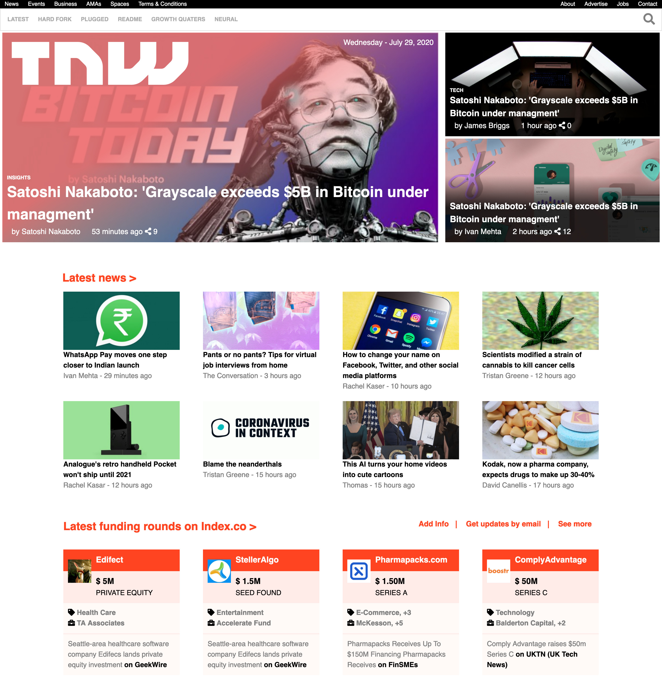
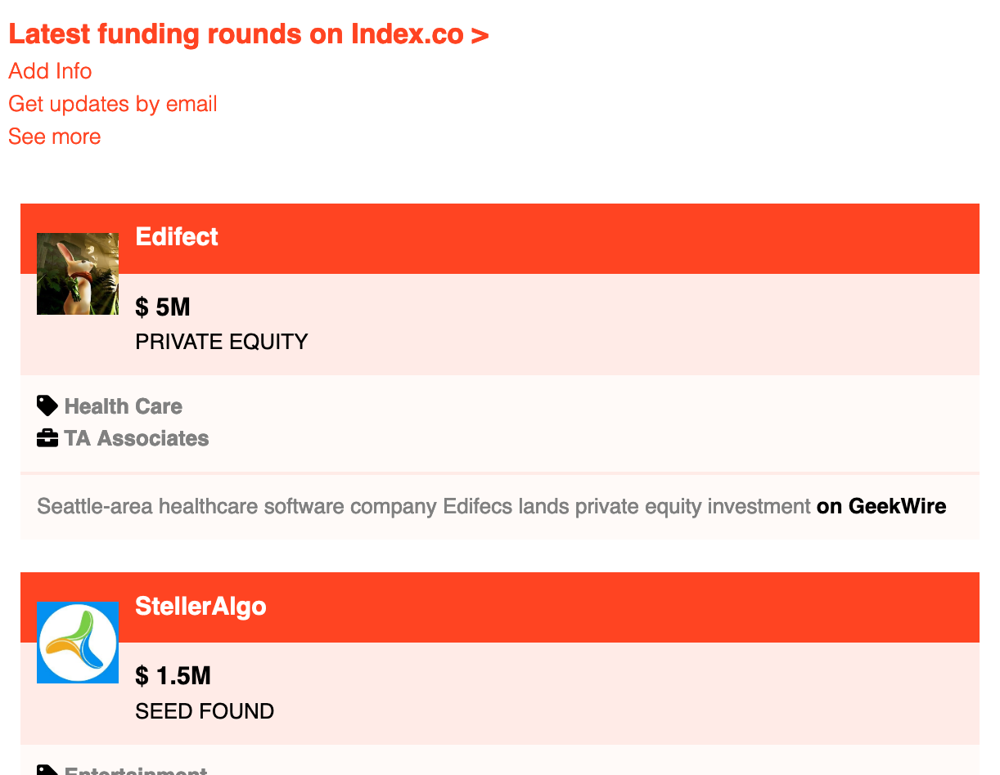
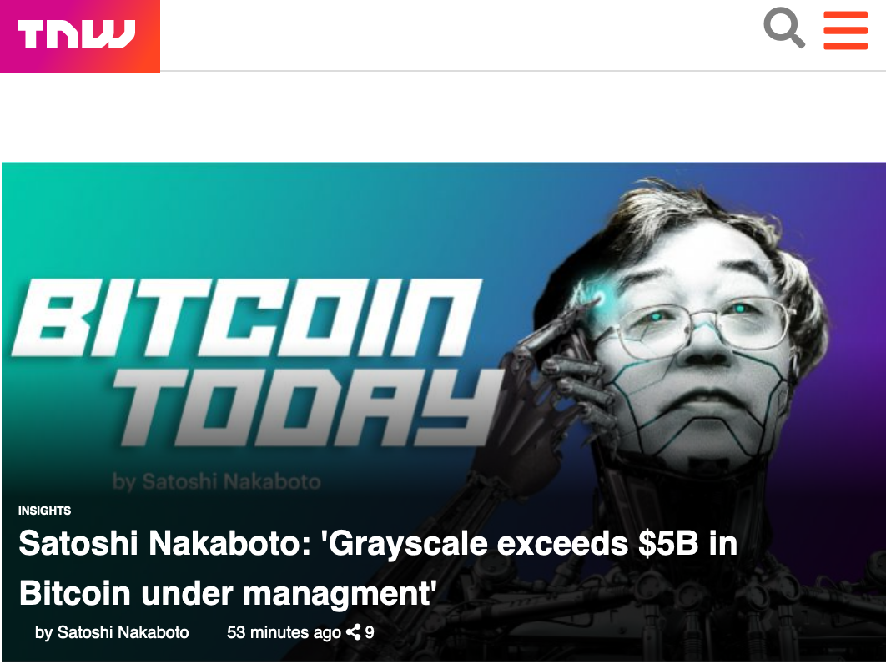
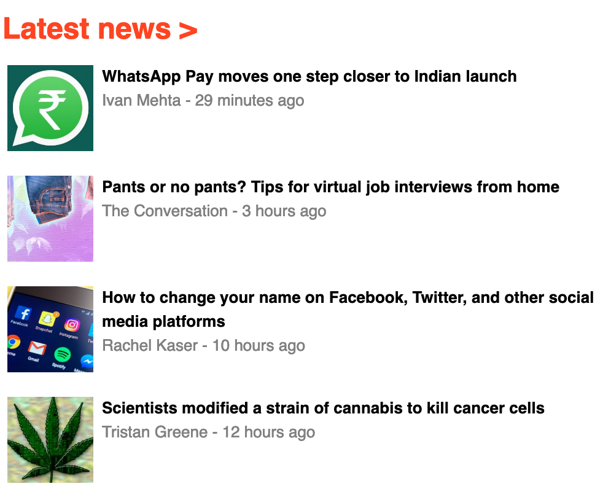
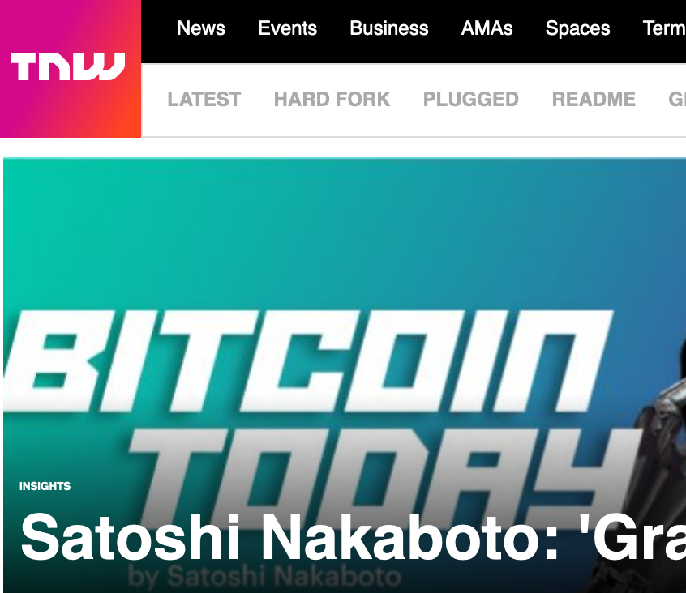
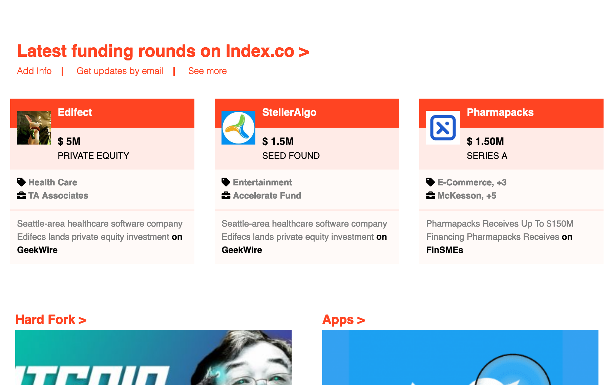

# The-Next-Web
This project is a clone of a tech-focused magazine named, "The Next Web", which uses media queries to gracefully degrade their site as the window size is reduced.



We used HTML & CSS, including GRID, Flex-Box and media queries. The webpage is visually responsive for all formats including mobile and for you to test this you can re-size the browser and you will see how the layout changes for differnet screen sizes.

## Responsive Changes

### Mobile 

  

### Tablet

 

## Built With
```
- HTML5 
- CSS3
- VS Code
- Font Awesome Icons
```
 
 

## Live Demo
 [The-Next-Web-Clone](https://raw.githack.com/LamiaSristy/The-Next-Web/master/index.html)


## Authors

👤 **Lamia Sristy**

 [@LamiaSristy](https://github.com/LamiaSristy) <br>


## 🤝 Contributing

Contributions, issues and feature requests are welcome!

Feel free to check the [issues page](enter issues url here).

## Show your support

Give a ⭐️ if you like this project!

## Acknowledgments

- Hat tip to anyone whose code was used
- Inspiration

## 📝 License

This project is [MIT](lic.url) licensed
